- [Overview:](#overview)
    - [Challenges and solutions during test](#challenges-and-solutions-during-test)
- [Performance Test Environment Setup](#performance-test-environment-setup)
  - [Alcor K8s cluster set up:](#alcor-k8s-cluster-set-up)
  - [Alcor Medina (OpenStack) cluster setup:](#alcor-medina-openstack-cluster-setup)
    - [How Rally interacts with OpenStack and test](#how-rally-interacts-with-openstack-and-test)
- [Performance Test Cases and Scenarios](#performance-test-cases-and-scenarios)
- [Performance Test Result](#performance-test-result)
  - [Alcor API Test for Port creation and list:](#alcor-api-test-for-port-creation-and-list)
    - [Max QPS is 3617](#max-qps-is-3617)
    - [When there is a lot of data in DB:](#when-there-is-a-lot-of-data-in-db)
    - [When run two test with the same configuration we will still have some different results:](#when-run-two-test-with-the-same-configuration-we-will-still-have-some-different-results)
  - [Alcor API Test for Subnet creation and list:](#alcor-api-test-for-subnet-creation-and-list)
    - [200 Concurrent:](#200-concurrent)
    - [300 Concurrent:](#300-concurrent)
    - [400 Concurrent:](#400-concurrent)
    - [500 Concurrent:](#500-concurrent)
  - [API Test, VPC:](#api-test-vpc)
  - [End to End Test with VM Creation:](#end-to-end-test-with-vm-creation)
  - [End-to-end Test, Small VPC:](#end-to-end-test-small-vpc)
  - [End-to-end VM creation Test for Large VPC scenario:](#end-to-end-vm-creation-test-for-large-vpc-scenario)
  - [End-to-end VM creation Test for Multiple Port per VM scenario:](#end-to-end-vm-creation-test-for-multiple-port-per-vm-scenario)
- [Conclusions and Future Work:](#conclusions-and-future-work)
- [Additional information:](#additional-information)
  - [Openstack VM Creation Process:](#openstack-vm-creation-process)

# Overview:  

In this performance test report, we will discuss the performance of the Alcor microservice.  
Alcor is a Hyperscale Cloud-Native SDN Platform; to test it, we have an OpenStack cluster called Medina and replace the Neutron in the OpenStack with Alcor. Neutron is an OpenStack project to provide "network connectivity as a service" between interface devices (e.g., vNICs) managed by other OpenStack services (e.g., Nova).  

For the performance testing, we used Rally to test both the Alcor API load and end-to-end tests, including VM (involves Nova) creation. Rally is an OpenStack project, it enables the performance test to simulate normal user or users input from OpenStack Horizon UI or CLI.   

### Challenges and solutions during test 

As mentioned earlier, we are using Rally to do both the Alcor API test and end-to-end VM creation tests inside a real OpenStack cluster.  
The OpenStack itself sometimes is the bottleneck for our tests.  
For example, when testing the Alcor API to create a network, Rally will go through OpenStack, and most OpenStack operations, if not all, will have to go through Keystone, which added an additional overhead to our test. As for the end-to-end VM creation tests, not only will Keystone be an overhead, Nova itself sometimes can become the bottleneck for our tests since Nova is very complex and involves many steps to create a VM. We will have further explained this later in the report.  

Another problem we run into is that when running performance tests, it can take extremely long to finish a test. There were two main scenarios:  
- First cause is during the clean-up stage of the performance tests. For example, we will create ports with really high concurrency. But after the test has finished, Rally will try to delete those ports been created earlier one by one. Which sometimes is extremely time-consuming.  
To **SOLVE** this slow clean-up issue, we disabled the network clean-up in Rally's Python code, reset our Alcor in the K8s cluster, and deleted Alcor's DB. From our solution, we can shorten 50 minutes long test to just 5 minutes.  
- The second issue we are running into that causes the performance tests to last really long is during end-to-end tests with VM creation. Not only this also include the above issue for VM clean up. It also has problems while creating VM. For example, VM doesn't always complete successfully during the Rally test. Rally will wait 300 seconds per VM if something goes wrong. And if some VM was not created successfully, Rally may very well also have issues deleting that particular VM, which will wait for another 600 seconds before time out.  
Our solutions to help with this situation are: Rebooting ACA, Nova-compute, clean-up OVS on all compute nodes, and rebooting Nova service in the controllers. Of course, those steps won't generate 100% success rate but will definitely help with the situation.  

# Performance Test Environment Setup 

Our entire setup consists of an OpenStack cluster with five controller nodes and 64 compute nodes. And a seven node K8s cluster for our Alcor services. Detail with be listed in the below section.  

## Alcor K8s cluster set up:  

| Machine                    | CPU                                       | Number of CPU | total vCPU | Memory (GB) |
| -------------------------- | ----------------------------------------- | ------------- | ---------- | ----------- |
| Control node 10.213.43.251 | Intel(R) Xeon(R) CPU E7-4809 v3 @ 2.00GHz | 2             | 32         | 32          |
| Worker node 10.213.43.69   | Intel(R) Xeon(R) CPU E5-2630 v3 @ 2.40GHz | 2             | 32         | 96          |
| Worker node 10.213.43.70   | Intel(R) Xeon(R) CPU E5-2630 v3 @ 2.40GHz | 2             | 32         | 96          |
| Worker node 10.213.43.71   | Intel(R) Xeon(R) CPU E5-2630 v3 @ 2.40GHz | 2             | 32         | 96          |
| Worker node 10.213.43.72   | Intel(R) Xeon(R) CPU E5-2630 v3 @ 2.40GHz | 2             | 32         | 96          |
| Worker node 10.213.43.73   | Intel(R) Xeon(R) CPU E5-2630 v3 @ 2.40GHz | 2             | 32         | 128         |
| Worker node 10.213.43.74   | Intel(R) Xeon(R) CPU E5-2630 v3 @ 2.40GHz | 2             | 32         | 128         |

## Alcor Medina (OpenStack) cluster setup:  

Our Alcor Medina (OpenStack) cluster is configured with five controller nodes and 64 workers (compute) nodes.  
Below is the list of OpenStack services running on our five controller nodes; all below services have one copy on each machine:  
- cinder_api_container  
- galera_container (Not used)  
- glance_container  
- heat_api_container  
- horizon_container  
- keystone_container  
- memcached_container  
- neutron_agents_container (Not used)  
- neutron_server_container (Not used)  
- nova_api_container  
- placement_container  
- rabbit_mq_container  
- repo_container  
- utility_container  

**Our controller nodes configurations:**  
| Machine                     | CPU                                       | Number of CPU | total vCPU | Memory (GB) |
| --------------------------- | ----------------------------------------- | ------------- | ---------- | ----------- |
| Controller 1: 10.213.43.169 | Intel(R) Xeon(R) CPU E5-2670 0 @ 2.60GHz  | 2             | 32         | 128         |
| Controller 2: 10.213.43.170 | Intel(R) Xeon(R) CPU E5-2670 0 @ 2.60GHz  | 2             | 32         | 128         |
| Controller 3: 10.213.43.171 | Intel(R) Xeon(R) CPU E5-2670 0 @ 2.60GHz  | 2             | 32         | 128         |
| Controller 4: 10.213.43.91  | Intel(R) Xeon(R) CPU E5-2680 v3 @ 2.50GHz | 1             | 24         | 32          |
| Controller 5: 10.213.43.94  | Intel(R) Xeon(R) CPU E5-2620 v3 @ 2.40GHz | 2             | 24         | 128         |

**Our compute nodes configurations:**  
- In total we have 2,808 vCPUs, 16,263 GB of RAM, and 64,254 GB of Storage

| **Hostname** | **VCPUs (total)** | **RAM (total)** | **Local Storage (total)** |
| ------------ | ----------------- | --------------- | ------------------------- |
| fw0015525    | 80                | 755.5GB         | 730GB                     |
| fw0015530    | 80                | 755.5GB         | 730GB                     |
| fw0015531    | 80                | 755.5GB         | 730GB                     |
| fw0015532    | 80                | 755.5GB         | 730GB                     |
| fw0015533    | 80                | 755.5GB         | 730GB                     |
| fw0015534    | 80                | 755.5GB         | 730GB                     |
| fw0015594    | 80                | 755.5GB         | 730GB                     |
| fw0014023    | 72                | 503.7GB         | 547GB                     |
| fw0012204    | 64                | 503.5GB         | 546GB                     |
| fw0012206    | 64                | 503.5GB         | 546GB                     |
| fw0012207    | 64                | 503.5GB         | 546GB                     |
| fw012208     | 64                | 503.5GB         | 546GB                     |
| fw0012205    | 64                | 440.5GB         | 547GB                     |
| fw0016584    | 56                | 377.5GB         | 1.4TB                     |
| fw0016585    | 56                | 377.5GB         | 1.4TB                     |
| fw0016586    | 56                | 377.5GB         | 1.4TB                     |
| fw0016587    | 56                | 377.5GB         | 1.4TB                     |
| fw0016590    | 56                | 377.5GB         | 1.4TB                     |
| fw0016591    | 56                | 377.5GB         | 1.4TB                     |
| fw0016592    | 56                | 377.5GB         | 1.4TB                     |
| fw0016593    | 56                | 377.5GB         | 1.4TB                     |
| fw0013944    | 48                | 125.5GB         | 1.1TB                     |
| fw0013945    | 48                | 125.5GB         | 1.1TB                     |
| fw0013946    | 48                | 125.5GB         | 1.1TB                     |
| fw0013465    | 40                | 377.5GB         | 363GB                     |
| fw0013466    | 40                | 377.5GB         | 363GB                     |
| fw0009091    | 40                | 188.9GB         | 272GB                     |
| fw0009102    | 40                | 188.9GB         | 271GB                     |
| fw0008851    | 40                | 125.8GB         | 1.8TB                     |
| fw0008852    | 40                | 125.8GB         | 1.8TB                     |
| fw0008854    | 40                | 125.8GB         | 1.8TB                     |
| fw0009055    | 40                | 125.8GB         | 1.8TB                     |
| fw0009058    | 40                | 125.8GB         | 1.8TB                     |
| fw0009060    | 40                | 125.8GB         | 1.8TB                     |
| fw0009076    | 32                | 125.9GB         | 547GB                     |
| fw0009078    | 32                | 125.9GB         | 547GB                     |
| fw0009079    | 32                | 125.9GB         | 547GB                     |
| fw0009080    | 32                | 125.9GB         | 547GB                     |
| fw0009081    | 32                | 125.9GB         | 547GB                     |
| fw0009084    | 32                | 125.9GB         | 547GB                     |
| fw0009085    | 32                | 125.9GB         | 547GB                     |
| fw0009089    | 32                | 125.9GB         | 547GB                     |
| fw0009090    | 32                | 125.9GB         | 547GB                     |
| fw0014027    | 32                | 125.5GB         | 546GB                     |
| fw0014031    | 32                | 125.5GB         | 546GB                     |
| fw0014032    | 32                | 125.5GB         | 546GB                     |
| fw0014036    | 32                | 125.5GB         | 546GB                     |
| fw0014037    | 32                | 125.5GB         | 546GB                     |
| fw0014039    | 32                | 125.5GB         | 546GB                     |
| fw0014040    | 32                | 125.5GB         | 546GB                     |
| fw0014041    | 32                | 125.5GB         | 546GB                     |
| fw0014042    | 32                | 125.5GB         | 546GB                     |
| fw0008970    | 24                | 62.8GB          | 1.8TB                     |
| fw0004220    | 24                | 31.3GB          | 913GB                     |
| fw0004223    | 24                | 31.3GB          | 1.8TB                     |
| fw0004226    | 24                | 31.3GB          | 1.8TB                     |
| fw0004229    | 24                | 31.3GB          | 1.8TB                     |
| fw0004232    | 24                | 31.3GB          | 1.8TB                     |
| fw0004233    | 24                | 31.3GB          | 1.8TB                     |
| fw0004234    | 24                | 31.3GB          | 1.8TB                     |
| fw0004237    | 24                | 31.3GB          | 1.8TB                     |
| fw0004744    | 24                | 15.6GB          | 1.8TB                     |
| fw0004747    | 24                | 15.6GB          | 1.8TB                     |
| fw00140019   | 24                | 125.5GB         | 547GB                     |

<br />

### How Rally interacts with OpenStack and test

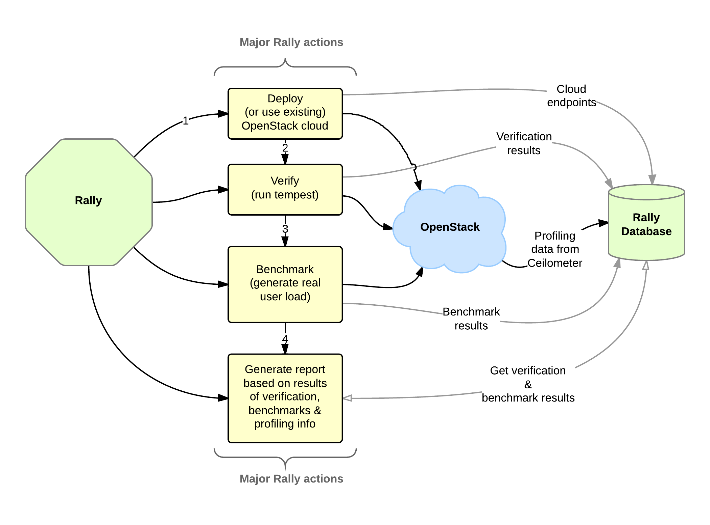

Rally works alongside OpenStack, and it will try to simulate the user input from the OpenStack dashboard or CLI. Still, it will also do some direct calls to each OpenStack service, but with a very similar workflow as organic user inputs.  

# Performance Test Cases and Scenarios  

We have two types of tests, API tests, and end-to-end tests:  
- For API level tests, we test the Alcor APIs only. Requests are sent directly from Rally to Alcor, then let Alcor do its job and write in DB  
  - Within API level tests, we mainly have Port, Subnet, VPC create and list test.
- For end-to-end tests, Rally will still send API requests to Alcor and let Alcor do its thing. The difference has been that we are using the results from Alcor; Alcor has to configure ACA and let nova boot VMs and attach the Port to the VMs.  
  - For end-to-end tests, we mainly have different scenarios for how many VM per VPC since all end-to-end tests booting VM will require the entire VPC, Subnet, and Port to function.  

During our Rally performance testing on Alcor API level and end-to-end with VM creation. We have faced the OpenStack overhead, and sometimes those overheads can affect our results significantly since some of our tasks only take milliseconds to perform on the Alcor side.  
To try to take out our results as much overhead from OpenStack as possible. We take out the first operation from the tests when calculating the QPS because that one will be impacted the most by the Keystone slowdown. For example, when creating ten ports, we observed that the first Port usually takes 5 to 10 times more time than other ports.  

**How we calculated our QPS in the tests:**  
> QPS = number of current / time per task  

**Our pod setup for our Alcor services in K8s during tests:**  

Unless specified, we are running with six pods each for Alcor DBs in the K8s environment for each API test. As for the Alcor services in the K8s, we start with five pods each, run six tests on that config, increase the number of Alcor services pods by 5, then rerun the tests. **Each column is a run configuration**.  

|                          | 5 pods| 10 pods| 15 pods| 20 pods| 25 pods|
| ------------------------ | ----- | ------ | ------ | ------ | ------ |
| ignite\_alcor\_dpm       | 1     | 1      | 1      | 1      | 1      |
| ignite\_alcor\_ncm       | 1     | 1      | 1      | 1      | 1      |
| ignite\_alcor\_ip        | 6     | 6      | 6      | 6      | 6      |
| ignite\_alcor\_mac       | 6     | 6      | 6      | 6      | 6      |
| ignite\_alcor\_port      | 6     | 6      | 6      | 6      | 6      |
| ignite\_alcor            | 6     | 6      | 6      | 6      | 6      |
| api-gateway              | 5     | 5      | 5      | 5      | 5      |
| dpm\_manager             | 5     | 5      | 5      | 5      | 5      |
| elastic\_ip\_manager     | 5     | 5      | 5      | 5      | 5      |
| gateway\_manager         | 5     | 5      | 5      | 5      | 5      |
| mac\_manager             | 5     | 5      | 5      | 5      | 5      |
| network\_config\_manager | 5     | 5      | 5      | 5      | 5      |
| node\_manager            | 5     | 5      | 5      | 5      | 5      |
| quota\_manager           | 5     | 5      | 5      | 5      | 5      |
| sg\_manager              | 5     | 5      | 5      | 5      | 5      |
| vpc\_manager             | 5     | 5      | 5      | 5      | 5      |
| port\_manager            | 5     | 10     | 15     | 20     | 25     |
| private\_ip\_manager     | 5     | 10     | 15     | 20     | 25     |
| route\_manager           | 5     | 10     | 15     | 20     | 25     |
| subnet\_manager          | 5     | 10     | 15     | 20     | 25     |

# Performance Test Result  

## Alcor API Test for Port creation and list:  

### Max QPS is 3617  

As we start to run our API tests, we are expected to see two patens.  
- As we do more runs on the same number of pod configurations in k8s for Alcor, we see an increase in QPS as the system starts to warm up, then the QPS may decrease again since we didn't clean up the DB after each run.  
- Second, we observed an increase in QPS as we increased the number of pods for Alcor services in the K8s cluster. But eventually, we may see the QPS stop growing or even decrease as we increase the number of Pods. Since we only have limited resources in our K8s cluster.  

For this test setup, we are requesting Alcor 1000 times at 500 concurrent, and within each request will tell Alcor to create 10 port.  
Below are the Rally test config file:  

```
{
    "title": "NeutronNetworks.create_and_list_ports",
    "description": "Create and a given number of ports and list all ports.",
    "scenario": {
        "NeutronNetworks.create_and_list_ports": {
            "network_create_args": {},
            "port_create_args": {},
            "ports_per_network": 10
        }
    },
    "contexts": {
        "network": {
            "start_cidr": "10.2.0.0/16",
            "networks_per_tenant": 1
        },
        "users": {
            "tenants": 500,
            "users_per_tenant": 2
        }
    },
    "runner": {
        "constant": {
            "times": 1000,
            "concurrency": 500
        }
    },
    "hooks": [],
    "sla": {
        "failure_rate": {
            "max": 0
        }
    }
}
```

Results:

|       | 5 pods     | 10 pods    | 15 pods    | 20 pods    | 25 pods     |
| ----- | ---------- | ---------- | ---------- | ---------- | ----------- |
| run 1 | 1121.50692 | 1100.61395 | 1168.04086 | 1196.7473  | 1147.375386 |
| run 2 | 2721.01403 | 2548.76433 | 2163.23577 | 2150.74443 | 1582.221191 |
| run 3 | 2773.95136 | 2858.57847 | **3617.86452** | 3241.52709 | 3501.67849  |
| run 4 | 1911.28605 | 2494.337   | 3078.50034 | 2987.68877 | 2765.557526 |
| run 5 | 2519.02377 | 3374.84124 | 2971.57462 | 2623.8086  | 2519.896116 |
| Avg   | 2481.3188  | 2819.13026 | 2957.79381 | 2750.94222 | 2592.338331 |
| Max   | 2773.95136 | 3374.84124 | **3617.86452** | 3241.52709 | 3501.67849  |

| | |
| --- | --- |
| 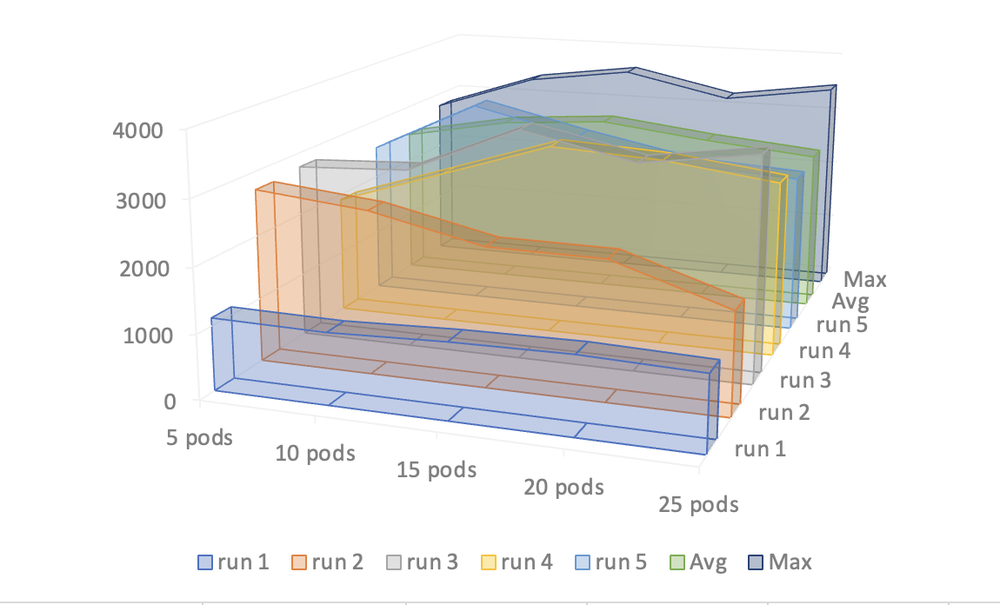 | 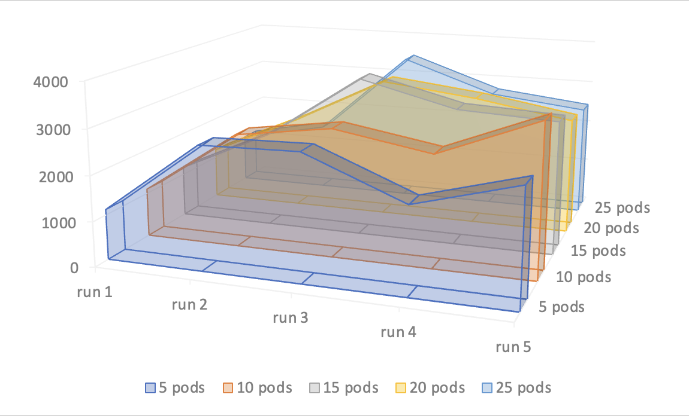 |

The above table and graph show that the maximum QPS we can reach is 3617, with 15 pods per Alcor service in the third run. Which further proved our idea. More K8s pods for Alcor will help with QPS, but if too many pods are going to compete for resources and hurt performance. And also need some worm up, and as more and more tests have been run without cleaning DB. So it is expected to see a performance drop too.  

<br />

### When there is a lot of data in DB:  

When there is a lot of data in DB, and list port is performed. Tests will get slower and slower. Since the un-deleted ports are still in the DB, which affects our list port performance, in turn, blocks our port creation process.  

For this test setup, we are requesting Alcor 1000 times at 200 concurrent, and within each request will tell Alcor to create 10 port.  
Below are the Rally test config file:  

```
{
    "title": "NeutronNetworks.create_and_list_ports",
    "description": "Create and a given number of ports and list all ports.",
    "scenario": {
        "NeutronNetworks.create_and_list_ports": {
            "network_create_args": {},
            "port_create_args": {},
            "ports_per_network": 10
        }
    },
    "contexts": {
        "network": {
            "start_cidr": "10.2.0.0/16",
            "networks_per_tenant": 1
        },
        "users": {
            "tenants": 100,
            "users_per_tenant": 2
        }
    },
    "runner": {
        "constant": {
            "times": 10000,
            "concurrency": 200
        }
    },
    "hooks": [],
    "sla": {
        "failure_rate": {
            "max": 0
        }
    }
}
```

Results:  

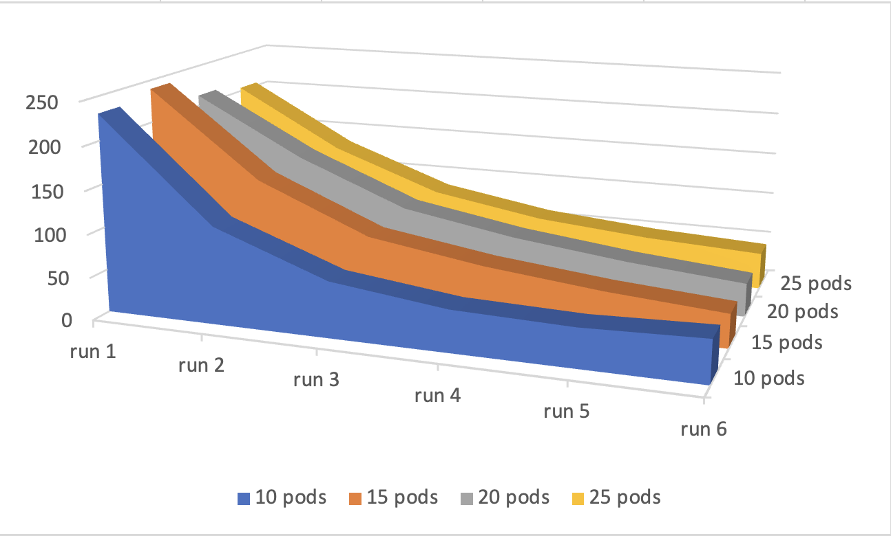

| Total port in db   |       | 5 pods     | 10 pods    | 15 pods    | 20 pods    | 25 pods    |
| ------------------ | ----- | ---------- | ---------- | ---------- | ---------- | ---------- |
|            200,000 | run 1 | 660.419311 | 1148.14224 | 1207.53903 |     NA     | 1278.44944 |
|            400,000 | run 2 | 531.593386 | 1301.06787 | 649.221554 | 1291.28651 | 962.154517 |
|            600,000 | run 3 | 407.093267 | 839.83475  | 390.815682 | 1109.67947 | 595.287361 |
|            800,000 | run 4 | 333.147894 | 605.249417 | 277.406563 | 643.881015 | 403.740213 |
|         1,000,000  | run 5 | 589.339683 | 461.90558  | 218.704972 | 441.839713 | 311.884807 |
|         1,200,000  | run 6 | 511.260062 | 368.871617 | 183.989337 | 345.633326 | 254.620887 |

<br />

### When run two test with the same configuration we will still have some different results:  

Same as above test, but without list port

```
{
    "title": "NeutronNetworks.create_and_list_ports",
    "description": "Create and a given number of ports and list all ports.",
    "scenario": {
        "NeutronNetworks.create_and_list_ports": {
            "network_create_args": {},
            "port_create_args": {},
            "ports_per_network": 10
        }
    },
    "contexts": {
        "network": {
            "start_cidr": "10.2.0.0/16",
            "networks_per_tenant": 1
        },
        "users": {
            "tenants": 100,
            "users_per_tenant": 2
        }
    },
    "runner": {
        "constant": {
            "times": 10000,
            "concurrency": 200
        }
    },
    "hooks": [],
    "sla": {
        "failure_rate": {
            "max": 0
        }
    }
}
```
Results:  

| run 1 | run 2|
| --- | --- |
| 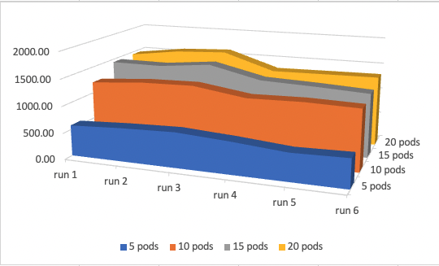 | 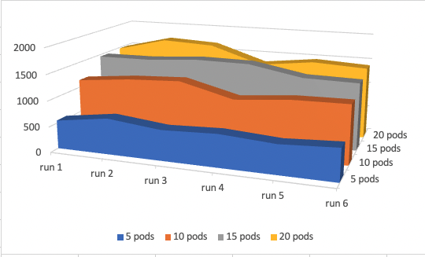 |
| 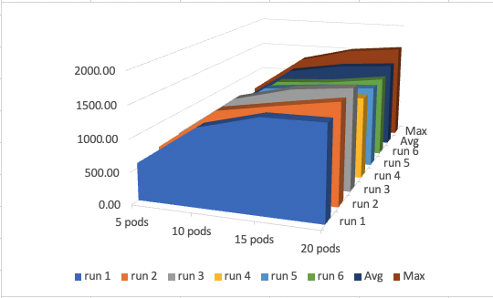 | 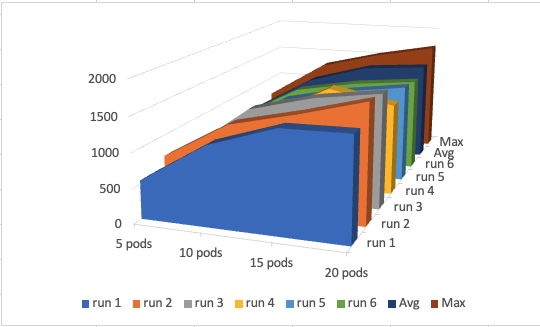 |

|       | 5 pods | 10 pods | 15 pods | 20 pods | \- |       | 5 pods     | 10 pods    | 15 pods    | 20 pods    |
| ----- | ------ | ------- | ------- | ------- | -- | ----- | ---------- | ---------- | ---------- | ---------- |
| run 1 | 577.97 | 1205.43 | 1442.56 | 1450.78 | \- | run 1 | 551.633277 | 1144.8677  | 1460.5069  | 1476.50134 |
| run 2 | 628.21 | 1282.10 | 1435.15 | 1577.70 | \- | run 2 | 695.677398 | 1245.01266 | 1467.48245 | 1724.25347 |
| run 3 | 658.90 | 1301.53 | 1530.06 | 1622.19 | \- | run 3 | 587.088398 | 1293.09311 | 1537.51299 | 1673.32094 |
| run 4 | 598.74 | 1155.63 | 1300.60 | 1308.11 | \- | run 4 | 629.011213 | 1028.6955  | 1524.64036 | 1341.9163  |
| run 5 | 516.99 | 1175.89 | 1262.10 | 1321.07 | \- | run 5 | 560.736288 | 1121.52361 | 1332.64095 | 1465.50503 |
| run 6 | 539.59 | 1149.98 | 1209.30 | 1331.10 | \- | run 6 | 618.331119 | 1137.34832 | 1312.16707 | 1410.69305 |
| Avg   | 586.73 | 1211.76 | 1363.29 | 1435.16 | \- | Avg   | 607.08     | 1161.76    | 1439.16    | 1515.37    |
| Max   | 658.90 | 1301.53 | 1530.06 | 1622.19 | \- | Max   | 695.68     | 1293.09    | 1537.51    | 1724.25    |

From the above run, we can see. If we don't perform the 'list' in the 'create and list port' test. The QPS will keep going up as the system is more and more warmed up. Unlike in the earlier test, when the DB has too much data, the 'list port' operation will take.  


<br />

## Alcor API Test for Subnet creation and list:  

The subnet API tests show that the limiting factor for QPS is not the number of Pod for Alcor's services in the K8s cluster.  
But rather is the DB performance. As more data is written into the DB, our QPS becomes slower, which is not correct. Usually, we should see an upward curve since our system needs to warm up after a complete reset.  

### 200 Concurrent:  

For this test setup, we are requesting Alcor 200 times at 200 concurrent, and within each request will tell Alcor to create 10 port.  
Below are the Rally test config file:  

```
{
    "title": "NeutronNetworks.create_and_list_subnets",
    "description": "Create and a given number of subnets and list all subnets.",
    "scenario": {
        "NeutronNetworks.create_and_list_subnets": {
            "network_create_args": {},
            "subnet_create_args": {},
            "subnet_cidr_start": "1.1.0.0/16",
            "subnets_per_network": 10
        }
    },
    "contexts": {
        "network": {},
        "users": {
            "tenants": 200,
            "users_per_tenant": 2
        }
    },
    "runner": {
        "constant": {
            "times": 200,
            "concurrency": 200
        }
    },
    "hooks": [],
    "sla": {
        "failure_rate": {
            "max": 0
        }
    }
}
```

Results:  

| | |
| --- | --- |
| 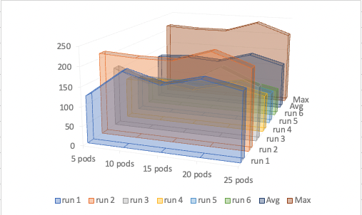 |  |

|       | 5 pods     | 10 pods    | 15 pods    | 20 pods    | 25 pods    |
| ----- | ---------- | ---------- | ---------- | ---------- | ---------- |
| run 1 | 122.171943 | 192.234644 | 165.971632 | 189.46115  | 170.649043 |
| run 2 | 213.156499 | 207.863239 | 208.112991 | **237.870493** | 204.961099 |
| run 3 | 158.115328 | 123.516043 | 131.565865 | 181.897132 | 140.867057 |
| run 4 | 109.365801 | 108.49676  | 95.6998481 | 117.866189 | 96.2321135 |
| run 5 | 94.2282891 | 91.5762681 | 85.3390427 | 103.22579  | 83.0531852 |
| run 6 | 66.536477  | 71.8048504 | 71.0391698 | 89.0149473 | 70.3936466 |
| Avg   | 127.262389 | 132.581967 | 126.288091 | 153.222617 | 127.692691 |
| Max   | 213.156499 | 207.863239 | 208.112991 | **237.870493** | 204.961099 |

### 300 Concurrent:  

For this test setup, we are requesting Alcor 300 times at 300 concurrent, and within each request will tell Alcor to create 10 port.  
Below are the Results:  

| | |
| --- | --- |
| 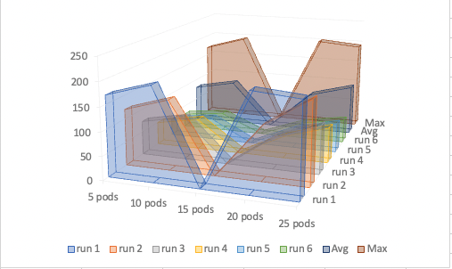 | 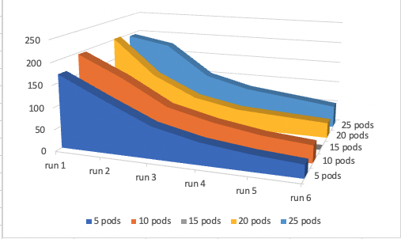 |

|       | 5 pods     | 10 pods    | 15 pods | 20 pods    | 25 pods    |
| ----- | ---------- | ---------- | ------- | ---------- | ---------- |
| run 1 | 168.864333 | 196.305945 |    NA   | **202.222719** | 194.40302  |
| run 2 | 119.860926 | 148.726237 |    NA   | 115.141975 | 175.556609 |
| run 3 | 73.4193208 | 91.39514   |    NA   | 67.2313068 | 102.948376 |
| run 4 | 49.9883674 | 66.2545772 |    NA   | 47.2278267 | 76.6703555 |
| run 5 | 37.4873497 | 49.0405038 |    NA   | 41.3234798 | 64.2762938 |
| run 6 | 29.7931549 | 40.0456381 |    NA   | 35.6744003 | 51.438147  |
| Avg   | 79.9022419 | 98.6280068 |    NA   | 84.8036178 | 110.882134 |
| Max   | 168.864333 | 196.305945 |    NA   | **202.222719** | 194.40302  |

### 400 Concurrent:  

For this test setup, we are requesting Alcor 400 times at 400 concurrent, and within each request will tell Alcor to create 10 port.  
Below are the Results:  

| | |
| --- | --- |
| 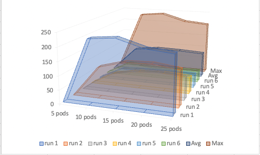 | 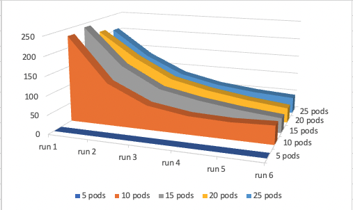 |

|       | 5 pods | 10 pods    | 15 pods    | 20 pods    | 25 pods    |
| ----- | ------ | ---------- | ---------- | ---------- | ---------- |
| run 1 |   NA   | 230.72542  | **239.914779** | 212.821755 | 204.047763 |
| run 2 |   NA   | 113.390071 | 140.163994 | 143.907342 | 132.528615 |
| run 3 |   NA   | 64.9454037 | 84.8448904 | 90.7973293 | 84.7995649 |
| run 4 |   NA   | 48.5527157 | 63.9578724 | 67.3949125 | 61.9916036 |
| run 5 |   NA   | 45.0106555 | 49.4495767 | 50.9884834 | 49.9585688 |
| run 6 |   NA   | 49.1970909 | 39.2756892 | 39.0478244 | 43.0528196 |
| Avg   |   NA   | 91.9702261 | 102.934467 | 100.826274 | 96.0631558 |
| Max   |   NA   | 230.72542  | **239.914779** | 212.821755 | 204.047763 |

### 500 Concurrent:  

For this test setup, we are requesting Alcor 500 times at 500 concurrent, and within each request will tell Alcor to create 10 port.  
Below are the Results:  

| | |
| --- | --- |
| 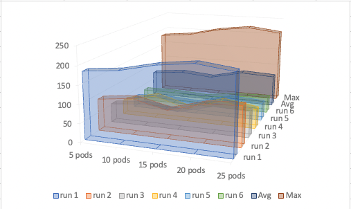 | 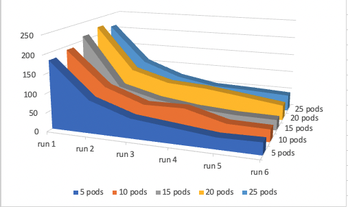 |

|       | 5 pods     | 10 pods    | 15 pods    | 20 pods    | 25 pods    |
| ----- | ---------- | ---------- | ---------- | ---------- | ---------- |
| run 1 | 180.997654 | 190.303224 | 211.520134 | **223.21284**  | 211.6647   |
| run 2 | 87.032023  | 98.4634246 | 76.639953  | 103.562334 | 109.248082 |
| run 3 | 52.1193785 | 61.2469792 | 50.0596896 | 74.3989519 | 71.4504471 |
| run 4 | 41.2890729 | 62.7838403 | 36.3336839 | 67.9391031 | 52.7183257 |
| run 5 | 30.0860401 | 34.7104692 | 29.5738334 | 54.4772135 | 49.2410235 |
| run 6 | 32.0612311 | 32.9007633 | 28.246774  | 40.2831089 | 44.1368398 |
| Avg   | 70.5975665 | 80.0681168 | 72.0623447 | 93.9789253 | 89.7432363 |
| Max   | 180.997654 | 190.303224 | 211.520134 | **223.21284**  | 211.6647   |

<br />

## API Test, VPC:  

The VPC test is, in general, very similar to the previous tests.  
The Biggest difference is when creating VPC; each time, it will have a considerable Keystone overhead that we cannot remove during calculation.  
Since the earlier tests are all within the VPC, then do some operation, then we can remove the first operation overhead. But in this case, each VPC is stand-alone and needs the entire process to be created. This is why we are seeing such low QPS on creating VPC.   

For this test setup, we are requesting Alcor 600 times at 600 concurrent, and within each request Alcor is creating 1 port.  


```
 {
      "title": "NeutronNetworks.create_and_list_networks",
      "description": "Create a network and then list all networks.",
      "scenario": {
        "NeutronNetworks.create_and_list_networks": {
          "network_create_args": {}
        }
      },
      "contexts": {
        "users": {
          "tenants": 1,
          "users_per_tenant": 2
        }
      },
      "runner": {
        "constant": {
          "times": 600,
          "concurrency": 600
        }
      },
      "hooks": [],
      "sla": {
        "failure_rate": {
          "max": 0
        }
      }
    }
```

Results:  

|       | 5 pods     | 10 pods | 15 pods    | 20 pods    | 25 pods     |
| ----- | ---------- | ------- | ---------- | ---------- | ----------- |
| run 1 | 87.3547123 |    NA   | 116.070835 | 117.163573 | 106.3543509 |
| run 2 | 97.9381727 |    NA   | 151.075641 | 141.532611 | 135.6119688 |
| run 3 | 127.521529 |    NA   | 119.350571 | 150.475931 | 138.4461197 |
| run 4 | 107.651403 |    NA   | **162.683393** | 142.332809 | 125.1218739 |
| run 5 | 97.4664581 |    NA   | 157.249331 | 106.5709   | 132.83853   |
| Avg   | 107.644391 |    NA   | 147.589734 | 135.228063 | 133.0046231 |
| Max   | 127.521529 |    NA   | **162.683393** | 150.475931 | 138.4461197 |

| | |
| --- | --- |
| 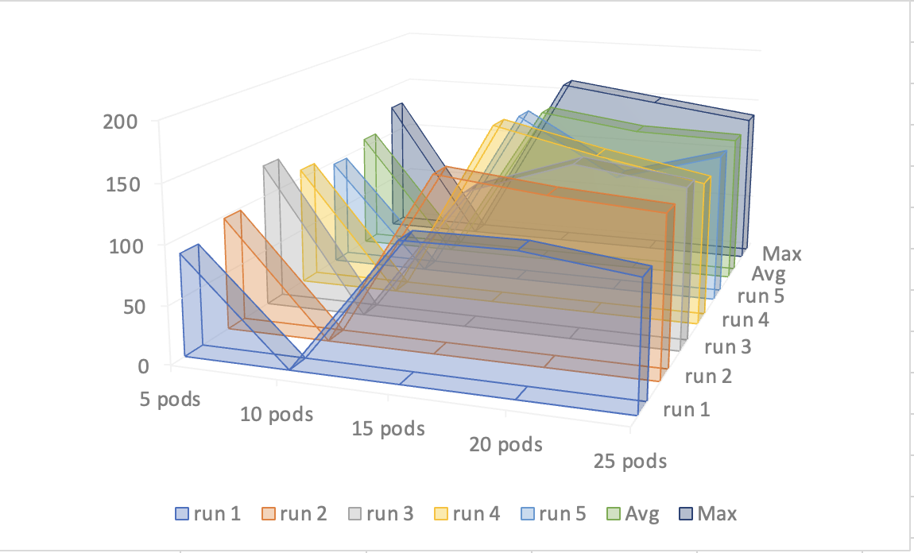 | 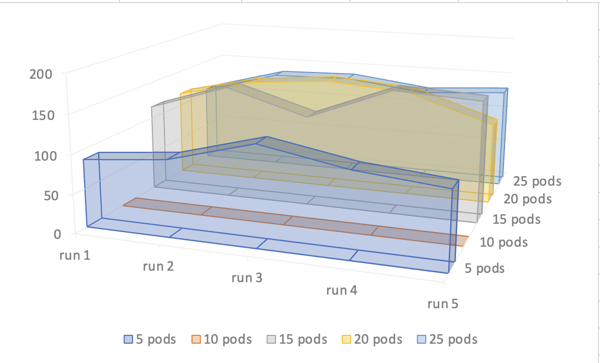 |

<br />

## End to End Test with VM Creation:

Our main issue is that Nova has been too slow for an end-to-end test. As a result, it doesn't directly reflect our Alcor performance.  
There are many steps taken when booting a VM with Nova in OpenStack. As those steps are taking place for each VM, Alcor is only a tiny part of it. Since the Nova takes really long to do its job, Alcor will be waiting a lot, thus why it is tough to push the limit of Alcor.  

It is hard to get a test to pass too, since Nova booting VM will fail from time to time. We have observed VM creation failure from both the Nova controller side and Nova compute side on compute hosts.  
- From compute side, we mainly see the issue of the "tap-device not found" error from ACA, which can be *'fixed'* if we change the Alcor timeout from 300 seconds to 600 seconds since Nova will re-try after 300 seconds and put in the tap-device.  
- From Nova server-side on the controller, we have observed many different types of errors when trying to create VMs really fast. For example, nova-schedular has many issues finding the right host, and messaging services sometimes error out. Lastly, the SQL DB on OpenStack cannot handle high concurrent, when as we create/delete VMs at a fast speed, the SQL DB results from having missed matches between tables.  

Below is a list of different tests we did with VM creation; the results do not seem ideal. But compared with others' performance on the internet, they seem reasonable with our current OpenStack configuration.  

## End-to-end Test, Small VPC:

For this small VPC test case, we boot one VM per one VPC. Request Alcor at 30 concurrency, within each request is booting 10 VPC, and for each VPC attach one VM.  

```
{
    "title": "NeutronPerformancePlugin.neutron_network_scalability",
    "description": "",
    "scenario": {
        "NeutronPerformancePlugin.neutron_network_scalability": {
            "flavor": {
                "name": "m1.tiny"
            },
            "image": {
                "name": "cirros-healthcheck"
            },
            "number_of_networks": 10,
            "instances_per_network": 1
        }
    },
    "contexts": {
        "users": {
            "users_per_tenant": 1,
            "tenants": 1
        },
        "quotas": {
            "nova": {
                "instances": -1,
                "cores": -1,
                "ram": -1
            }
        }
    },
    "runner": {
        "constant": {
            "times": 30,
            "concurrency": 30
        }
    },
    "hooks": [],
    "sla": {
        "failure_rate": {
            "max": 50
        }
    }
}
```

Results:  

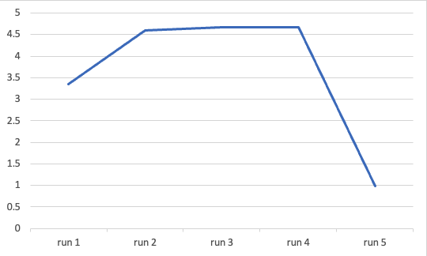

|       | 5 pods     |
| ----- | ---------- |
| run 1 | 3.34631731 |
| run 2 | 4.60502671 |
| run 3 | 4.66211621 |
| run 4 | 4.67599231 |
| run 5 | 0.97742867 |

<br />

From the graph, we can see about 4.5 QPS we can reach. For run 5, the VM creation starts to fail, thus why we see a huge drop in QPS.  

## End-to-end VM creation Test for Large VPC scenario:  

In this test, we will have multiple VMs per VPC. And each VM will have one port attached to it.  
Rally will request Alcor with 15 concurrent requests; within each request, Alcor will create 10 VPC, and within each VPC will be 10 VMs attached to it.  

```
{
    "title": "NeutronPerformancePlugin.neutron_network_scalability",
    "description": "",
    "scenario": {
        "NeutronPerformancePlugin.neutron_network_scalability": {
            "flavor": {
                "name": "m1.tiny"
            },
            "image": {
                "name": "cirros-healthcheck"
            },
            "number_of_networks": 10,
            "instances_per_network": 10,
            "instance_booting_requests": 1
        }
    },
    "contexts": {
        "users": {
            "users_per_tenant": 1,
            "tenants": 1
        },
        "quotas": {
            "nova": {
                "instances": -1,
                "cores": -1,
                "ram": -1
            }
        }
    },
    "runner": {
        "constant": {
            "times": 15,
            "concurrency": 15,
            "timeout": 50000
        }
    },
    "hooks": [],
    "sla": {
        "failure_rate": {
            "max": 50
        }
    }
}
```

Results:  

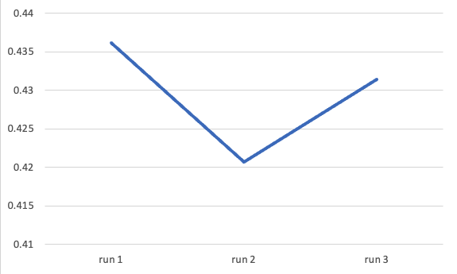

|       | 10 pods    |
| ----- | ---------- |
| run 1 | 0.43619856 |
| run 2 | 0.42073825 |
| run 3 | 0.43146736 |

For large VPC scenario, booting 10 VM per VPC we can reach about .4 QPS.  

<br />

## End-to-end VM creation Test for Multiple Port per VM scenario:   

This test is similar to the above but compared to only one port per VM. This test will have ten ports per VM.  

```
{
    "title": "AlcorPortPerformancePlugin.alcor_port_scalability",
    "description": "",
    "scenario": {
        "AlcorPortPerformancePlugin.alcor_port_scalability": {
            "flavor": {
                "name": "m1.tiny"
            },
            "image": {
                "name": "cirros-healthcheck"
            },
            "number_of_networks": 9,
            "instances_per_network": 10,
            "instance_booting_requests": 1,
            "ports_per_instance": 10
        }
    },
    "contexts": {
        "users": {
            "users_per_tenant": 1,
            "tenants": 1
        },
        "quotas": {
            "nova": {
                "instances": -1,
                "cores": -1,
                "ram": -1
            }
        }
    },
    "runner": {
        "constant": {
            "times": 10,
            "concurrency": 10,
            "timeout": 100000
        }
    },
    "hooks": [],
    "sla": {
        "failure_rate": {
            "max": 0
        }
    }
}
```

Results:  

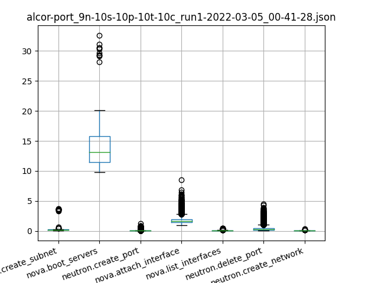

We can see from the above graph that during our test with multiple port per VM. The time toke for Alcor to perform is reasonably fast. But "boot server" by Nova is taken about 30 seconds each, which significantly limits our end-to-end performance.  

<br />

# Conclusions and Future Work:  

In Conclusion, Alcor's performance has lived up to our expectations. But because of the limitation of Rally and OpenStack overhead, we did not reach the actual limitation of Alcor. In the future, we can use or make some tools to communicate with Alcor directly, bypassing all the overhead to see the true performance of Alcor.  

As for the end-to-end test that includes VM booting and all other OpenStack components, we can try to redeploy our OpenStack cluster to have more controller nodes. Also, let each OpenStack service have its own machines, rather than all stack together. And at least have SSD for the SQL DB.  
Also, we can try the TripleO (cloud on the cloud) for our OpenStack cluster, which will enable us to have the ability to change OpenStack configuration quickly. Thus we can test with more flexibility and faster reset speed if anything goes wrong.   

# Additional information:  

## Openstack VM Creation Process:

Below is the process of when creating a VM from the OpenStack Horizon UI or CLI. In our situation, we have replaced Neutron with Alcor. As we can see, only step 12 and step 13 are involving Neutron (in our case Alcor) to create a VM.

[Ref](https://www.linuxtechi.com/step-by-step-instance-creation-flow-in-openstack/)  

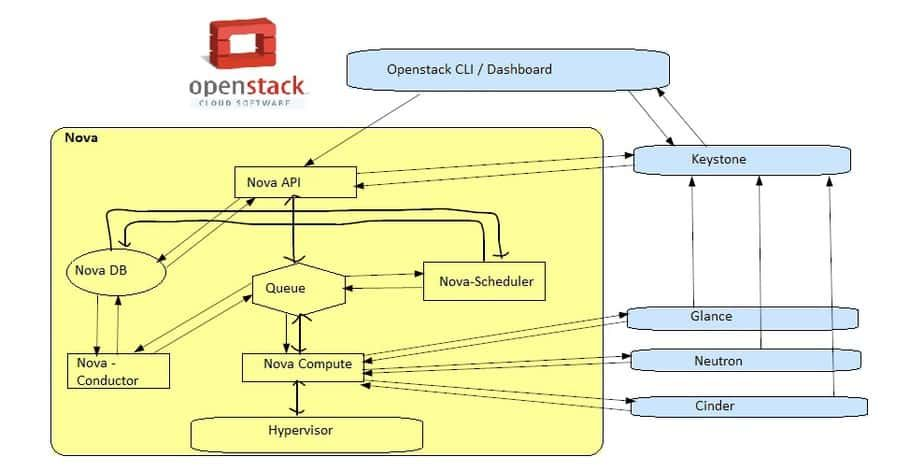  

> Step:1) The Horizon Dashboard or OpenStack CLI gets user credentials and authenticates with identity service via REST API  
> 
> - The identity service (Keystone) authenticate the user with the user credentials and then generates and send back an auth-token, that auth-token which will be used for sending the request to other components through REST-Call  
> 
> Step:2) The Dashboard or OpenStack CLI converts new instance request specified in launch instance or nova boot command to a REST API request and sent it to nova-api  
> 
> Step:3) Then nova-api service gets the request and send that request to the identity service (Keystone) for validation of auth-token and access permission,  
> 
> - Keystone service validates the token and send the updated authentication headers with roles along with the permissions  
> 
> Step:4) After getting the response from keystone, then  nova-api checks for conflicts with nova-database and then it creates initial database entry for new instance or VM.  
> 
> Step:5) nova-api sends the rpc.call request to nova-scheduler expecting to get updated instance entry with host id specified  
> 
> Step:6) Now nova-scheduler picks the request from the queue  
> 
> Step:7) nova-scheduler talks to nova-database to locate an appropriate host using filtering and weighing mechanism,  
> 
> - nova-scheduler returns the updated instance entry with the appropriate host ID after filtering and weighing  
> - nova-scheduler sends the rpc.cast request to nova compute for launching an instance on the appropriate host  
> 
> Step:8) nova-compute picks the request from the queue and it sends the rpc.call request to nova-conductor to get the VM or instance info such as host id and flavor (RAM,CPU and Disk)  
> 
> Step:9) nova-conductor takes the request from queue and communicate with nova-database,  
> 
> - nova-conductor gets the instance information  
> - now nova-compute picks the instance information from the queue  
> 
> Step:10) nova-compute connects to glance-api by making a REST Call using auth-token and then nova-compute uses the image id to get the image URI from image service and loads the image from image storage
> 
> Step:11) glance-api validates the auth-token with keystone and after that nova-compute gets the image metadata  
> 
> Step:12) Nova-compute make the REST-call by passing the auth-token to Network API (Neutron) to allocate and configure network so that vm gets the IP address  
> 
> Step:13) Neutron-server validates the auth-token with keystone and after that nova-compute retrieves the network information.  
> 
> Step:14) Nova-Compute makes the REST-call by passing the auth-token to Volume API to attach the volume to the instance or VM.  
> 
> Step:15) cinder-api validates the auth-token with keystone and then nova-compute gets the block storage information.  
> 
> Step:16) nova-compute generates data for the hypervisor driver and executes the request on the hypervisor using libvirt or API and then finally a VM is created on the hypervior. We can see that VM in Dashboard and also using “nova list” command.  