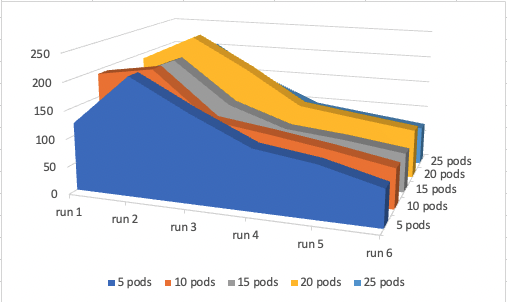

# Introduction  

### Overview:  

In this performance test report, we will discuss what is the performance of Alcor microservice.  
Alcor is a A Hyperscale Cloud Native SDN Platform, for us to test it, we have an OpenStack cluster called Medina, and replace the Neutron in the OpenStack with Alcor. Neutron is an OpenStack project to provide "network connectivity as a service" between interface devices (e.g., vNICs) managed by other OpenStack services (e.g., Nova).  

For the performance testing, we will use Rally to test both the Alcor API load and ene-to-end tests include VM (involves Nova) creation. Rally is an OpenStack project, it enables the performance to simulate normal user or users input from OpenStack Horizon UI or CLI.  

### Issues:  

As mentioned earlier, we are using Rally to do both the Alcor API test and end-to-end VM creation tests inside a real OpenStack cluster.  
The OpenStack itself sometimes will become the bottleneck for our tests.  
For example, when testing the Alcor API to create a network, Rally will go through OpenStack, and most of OpenStack operation if not all will have to go through Keystone. Which will add an overhead to our test. As for the end-to-end VM creation tests, not only keystone will be a overhead, Nova itself sometimes will become the bottleneck for our tests. Since Nova is very complex and involves many steps to create a VM. Will have farther explain later in the report.  

Another problem we run into is that when running performance tests it can take extremely long to finish a test. There were two main scenarios:  
- First cause is during the clean up stage during the performance tests. For example, we will create ports with really high concurrency. But after the test have finished, Rally will try to delete those ports been created earlier one-by-one. Which sometimes is extremely time consuming.  
To **SOLVE** this slow cleanup issue, we disabled the network cleanup in Rally's Python code, then reset our Alcor in the K8s cluster and delete Alcor's DB. From our solution, we can shorten a 50 mins long test in to just 5 mins.  
- Second issue we are running into that cause the performance tests to last really long is during end-to-end tests with VM creation. Not only this also include the above issue for VM clean up. It also have issues during creating VM. When during Rally test, VM don't always created successfully. Rally will 300 seconds per VM if something goes wrong. And if some VM was not created successfully, Rally may very well also have issues deleting that particular VM, which will waite for another 600 seconds before time out.  
Our solution to help with this situation are: Rebooting ACA, Nova-compute and cleanup OVS on all compute node, rebooting Nova service in the controllers. Those steps won't generate 100% success rate, but will definitely help with the situation.  

# Performance Setup  

Our entire setup consist of an OpenStack cluster with 5 controller node and 64 compute nodes. And a 7 node K8s cluster for our Alcor services. Detail with be listed in below section.  

## Alcor K8s cluster set up:  

| Machine                    | CPU                                       | Number of CPU | total vCPU | Memory (GB) |
| -------------------------- | ----------------------------------------- | ------------- | ---------- | ----------- |
| Control node 10.213.43.251 | Intel(R) Xeon(R) CPU E7-4809 v3 @ 2.00GHz | 2             | 32         | 32          |
| Worker node 10.213.43.69   | Intel(R) Xeon(R) CPU E5-2630 v3 @ 2.40GHz | 2             | 32         | 96          |
| Worker node 10.213.43.70   | Intel(R) Xeon(R) CPU E5-2630 v3 @ 2.40GHz | 2             | 32         | 96          |
| Worker node 10.213.43.71   | Intel(R) Xeon(R) CPU E5-2630 v3 @ 2.40GHz | 2             | 32         | 96          |
| Worker node 10.213.43.72   | Intel(R) Xeon(R) CPU E5-2630 v3 @ 2.40GHz | 2             | 32         | 96          |
| Worker node 10.213.43.73   | Intel(R) Xeon(R) CPU E5-2630 v3 @ 2.40GHz | 2             | 32         | 128         |
| Worker node 10.213.43.74   | Intel(R) Xeon(R) CPU E5-2630 v3 @ 2.40GHz | 2             | 32         | 128         |

## Alcor Medina (OpenStack) cluster setup:  

Our Alcor Medina (OpenStack) cluster is configured with 5 controller node, and 64 worker (compute) nodes.  
Below are the list of OpenStack services running on our 5 controller node, all below service have one copy on each machine:  
- cinder_api_container  
- galera_container  
- glance_container  
- heat_api_container  
- horizon_container  
- keystone_container  
- memcached_container  
- neutron_agents_container (Not used)  
- neutron_server_container (Not used)  
- nova_api_container  
- placement_container  
- rabbit_mq_container  
- repo_container  
- utility_container  

**Our controller nodes configurations:**  
| Machine                     | CPU                                       | Number of CPU | total vCPU | Memory (GB) |
| --------------------------- | ----------------------------------------- | ------------- | ---------- | ----------- |
| Controller 1: 10.213.43.169 | Intel(R) Xeon(R) CPU E5-2670 0 @ 2.60GHz  | 2             | 32         | 128         |
| Controller 2: 10.213.43.170 | Intel(R) Xeon(R) CPU E5-2670 0 @ 2.60GHz  | 2             | 32         | 128         |
| Controller 3: 10.213.43.171 | Intel(R) Xeon(R) CPU E5-2670 0 @ 2.60GHz  | 2             | 32         | 128         |
| Controller 4: 10.213.43.91  | Intel(R) Xeon(R) CPU E5-2680 v3 @ 2.50GHz | 1             | 24         | 32          |
| Controller 5: 10.213.43.94  | Intel(R) Xeon(R) CPU E5-2620 v3 @ 2.40GHz | 2             | 24         | 128         |

**Our compute nodes configurations:**  
- In total we have 2,808 vCPUs, 16,263 GB of RAM, and 64,254 GB of Storage

| VCPUs (total) | RAM (total) | Local Storage (total) |
| ------------- | ----------- | --------------------- |
| 80            | 755.5GB     | 730GB                 |
| 80            | 755.5GB     | 730GB                 |
| 80            | 755.5GB     | 730GB                 |
| 80            | 755.5GB     | 730GB                 |
| 80            | 755.5GB     | 730GB                 |
| 80            | 755.5GB     | 730GB                 |
| 80            | 755.5GB     | 730GB                 |
| 72            | 503.7GB     | 547GB                 |
| 64            | 503.5GB     | 546GB                 |
| 64            | 440.5GB     | 547GB                 |
| 64            | 503.5GB     | 546GB                 |
| 64            | 503.5GB     | 546GB                 |
| 64            | 503.5GB     | 546GB                 |
| 56            | 377.5GB     | 1.4TB                 |
| 56            | 377.5GB     | 1.4TB                 |
| 56            | 377.5GB     | 1.4TB                 |
| 56            | 377.5GB     | 1.4TB                 |
| 56            | 377.5GB     | 1.4TB                 |
| 56            | 377.5GB     | 1.4TB                 |
| 56            | 377.5GB     | 1.4TB                 |
| 56            | 377.5GB     | 1.4TB                 |
| 48            | 125.5GB     | 1.1TB                 |
| 48            | 125.5GB     | 1.1TB                 |
| 48            | 125.5GB     | 1.1TB                 |
| 40            | 125.8GB     | 1.8TB                 |
| 40            | 125.8GB     | 1.8TB                 |
| 40            | 125.8GB     | 1.8TB                 |
| 40            | 125.8GB     | 1.8TB                 |
| 40            | 125.8GB     | 1.8TB                 |
| 40            | 125.8GB     | 1.8TB                 |
| 40            | 188.9GB     | 272GB                 |
| 40            | 188.9GB     | 271GB                 |
| 40            | 377.5GB     | 363GB                 |
| 40            | 377.5GB     | 363GB                 |
| 32            | 125.9GB     | 547GB                 |
| 32            | 125.9GB     | 547GB                 |
| 32            | 125.9GB     | 547GB                 |
| 32            | 125.9GB     | 547GB                 |
| 32            | 125.9GB     | 547GB                 |
| 32            | 125.9GB     | 547GB                 |
| 32            | 125.9GB     | 547GB                 |
| 32            | 125.9GB     | 547GB                 |
| 32            | 125.9GB     | 547GB                 |
| 32            | 125.5GB     | 546GB                 |
| 32            | 125.5GB     | 546GB                 |
| 32            | 125.5GB     | 546GB                 |
| 32            | 125.5GB     | 546GB                 |
| 32            | 125.5GB     | 546GB                 |
| 32            | 125.5GB     | 546GB                 |
| 32            | 125.5GB     | 546GB                 |
| 32            | 125.5GB     | 546GB                 |
| 32            | 125.5GB     | 546GB                 |
| 24            | 31.3GB      | 913GB                 |
| 24            | 31.3GB      | 1.8TB                 |
| 24            | 31.3GB      | 1.8TB                 |
| 24            | 31.3GB      | 1.8TB                 |
| 24            | 31.3GB      | 1.8TB                 |
| 24            | 31.3GB      | 1.8TB                 |
| 24            | 31.3GB      | 1.8TB                 |
| 24            | 31.3GB      | 1.8TB                 |
| 24            | 15.6GB      | 1.8TB                 |
| 24            | 15.6GB      | 1.8TB                 |
| 24            | 62.8GB      | 1.8TB                 |
| 24            | 125.5GB     | 547GB                 |

<br />

### How Rally interact with OpenStack and test


Rally work along side of OpenStack, it will try to simulate the user input from OpenStack dashboard or CLI, but it will also do some direct calls to each openstack services, but with very similar workflow as organic user inputs.  

# Performance Test Insights  

During our Rally performance testing on Alcor API level and end-to-end with VM creation. We will face the OpenStack overhead, and sometimes those overhead can affect our results greatly since some of our tasks only take millisecond to perform in Alcor side.  
To try to take out as much overhead from OpenStack as possible from our results. We take out the first operation from the tests when calculate the QPS, because that one will be impact the most from keystone slowdown. For example, when create 10 port, we have observe the first port usually take 5 to 10 times more time than other ports.

**How we calculated our QPS in the tests:**  
> QPS = number of current / time per task  

**Our pod setup for our Alcor services in K8s during tests:**  

For each API test, unless specified, we are running with 6 pod each for Alcor DBs in the K8s environment, as for the Alcor services in the K8s we are starting with 5 pod each; run 6 tests on that config, then increase the number of Alcor services pod by 5, then run the tests again.  

|                          | 5 pod | 10 pod | 15 pod | 20 pod | 25 pod |
| ------------------------ | ----- | ------ | ------ | ------ | ------ |
| ignite\_alcor\_dpm       | 1     | 1      | 1      | 1      | 1      |
| ignite\_alcor\_ncm       | 1     | 1      | 1      | 1      | 1      |
| ignite\_alcor\_ip        | 6     | 6      | 6      | 6      | 6      |
| ignite\_alcor\_mac       | 6     | 6      | 6      | 6      | 6      |
| ignite\_alcor\_port      | 6     | 6      | 6      | 6      | 6      |
| ignite\_alcor            | 6     | 6      | 6      | 6      | 6      |
| api-gateway              | 5     | 5      | 5      | 5      | 5      |
| dpm\_manager             | 5     | 5      | 5      | 5      | 5      |
| elastic\_ip\_manager     | 5     | 5      | 5      | 5      | 5      |
| gateway\_manager         | 5     | 5      | 5      | 5      | 5      |
| mac\_manager             | 5     | 5      | 5      | 5      | 5      |
| network\_config\_manager | 5     | 5      | 5      | 5      | 5      |
| node\_manager            | 5     | 5      | 5      | 5      | 5      |
| quota\_manager           | 5     | 5      | 5      | 5      | 5      |
| sg\_manager              | 5     | 5      | 5      | 5      | 5      |
| vpc\_manager             | 5     | 5      | 5      | 5      | 5      |
| port\_manager            | 5     | 10     | 15     | 20     | 25     |
| private\_ip\_manager     | 5     | 10     | 15     | 20     | 25     |
| route\_manager           | 5     | 10     | 15     | 20     | 25     |
| subnet\_manager          | 5     | 10     | 15     | 20     | 25     |

## API Test, Port:  

### Max QPS is 3617  

As we start to run our API tests, we are expected to see two patens.  
- One is as we do more runs on the same number of pod configuration in k8s for Alcor, we will see a increase in QPS as system start to warmup, then the QPS may decrease again since we didn't cleanup the DB after each run.  
- Second, we will expect to see an increase in QPS as we increase the number of pods for Alcor service's in the K8s cluster. But eventually we may see the QPS stop growing, or even decreasing as we increase the number of Pods. Since we only have limited resources in our K8s cluster.  

```
{
    "title": "NeutronNetworks.create_and_list_ports",
    "description": "Create and a given number of ports and list all ports.",
    "scenario": {
        "NeutronNetworks.create_and_list_ports": {
            "network_create_args": {},
            "port_create_args": {},
            "ports_per_network": 10
        }
    },
    "contexts": {
        "network": {
            "start_cidr": "10.2.0.0/16",
            "networks_per_tenant": 1
        },
        "users": {
            "tenants": 500,
            "users_per_tenant": 2
        }
    },
    "runner": {
        "constant": {
            "times": 1000,
            "concurrency": 500
        }
    },
    "hooks": [],
    "sla": {
        "failure_rate": {
            "max": 0
        }
    }
}
```

|       | 5 pods     | 10 pods    | 15 pods    | 20 pods    | 25 pods     |
| ----- | ---------- | ---------- | ---------- | ---------- | ----------- |
| run 1 | 1121.50692 | 1100.61395 | 1168.04086 | 1196.7473  | 1147.375386 |
| run 2 | 2721.01403 | 2548.76433 | 2163.23577 | 2150.74443 | 1582.221191 |
| run 3 | 2773.95136 | 2858.57847 | 3617.86452 | 3241.52709 | 3501.67849  |
| run 4 | 1911.28605 | 2494.337   | 3078.50034 | 2987.68877 | 2765.557526 |
| run 5 | 2519.02377 | 3374.84124 | 2971.57462 | 2623.8086  | 2519.896116 |
| Avg   | 2481.3188  | 2819.13026 | 2957.79381 | 2750.94222 | 2592.338331 |
| Max   | 2773.95136 | 3374.84124 | 3617.86452 | 3241.52709 | 3501.67849  |

| | |
| --- | --- |
|  |  |


<br />

### When there is a lot of data in DB:  

When there is a lot of data in DB, and list port is performed. Tests will got slower and slower. Since the un-deleted ports are still in the DB which are affect our list port performance, in turn block our port creation process.  

```
{
    "title": "NeutronNetworks.create_and_list_ports",
    "description": "Create and a given number of ports and list all ports.",
    "scenario": {
        "NeutronNetworks.create_and_list_ports": {
            "network_create_args": {},
            "port_create_args": {},
            "ports_per_network": 10
        }
    },
    "contexts": {
        "network": {
            "start_cidr": "10.2.0.0/16",
            "networks_per_tenant": 1
        },
        "users": {
            "tenants": 100,
            "users_per_tenant": 2
        }
    },
    "runner": {
        "constant": {
            "times": 10000,
            "concurrency": 200
        }
    },
    "hooks": [],
    "sla": {
        "failure_rate": {
            "max": 0
        }
    }
}
```


| Total port in db   |       | 5          | 10         | 15         | 20         | 25         |
| ------------------ | ----- | ---------- | ---------- | ---------- | ---------- | ---------- |
|            200,000 | run 1 | 660.419311 | 1148.14224 | 1207.53903 |            | 1278.44944 |
|            400,000 | run 2 | 531.593386 | 1301.06787 | 649.221554 | 1291.28651 | 962.154517 |
|            600,000 | run 3 | 407.093267 | 839.83475  | 390.815682 | 1109.67947 | 595.287361 |
|            800,000 | run 4 | 333.147894 | 605.249417 | 277.406563 | 643.881015 | 403.740213 |
|         1,000,000  | run 5 | 589.339683 | 461.90558  | 218.704972 | 441.839713 | 311.884807 |
|         1,200,000  | run 6 | 511.260062 | 368.871617 | 183.989337 | 345.633326 | 254.620887 |

<br />

### When run two test with the same configuration we will still have some different results:  

Same as above test, but without list port

```
{
    "title": "NeutronNetworks.create_and_list_ports",
    "description": "Create and a given number of ports and list all ports.",
    "scenario": {
        "NeutronNetworks.create_and_list_ports": {
            "network_create_args": {},
            "port_create_args": {},
            "ports_per_network": 10
        }
    },
    "contexts": {
        "network": {
            "start_cidr": "10.2.0.0/16",
            "networks_per_tenant": 1
        },
        "users": {
            "tenants": 100,
            "users_per_tenant": 2
        }
    },
    "runner": {
        "constant": {
            "times": 10000,
            "concurrency": 200
        }
    },
    "hooks": [],
    "sla": {
        "failure_rate": {
            "max": 0
        }
    }
}
```
| run 1 | run 2|
| --- | --- |
|  |  |
|  |  |

|       | 5 pods | 10 pods | 15 pods | 20 pods | \- |       | 5 pods     | 10 pods    | 15 pods    | 20 pods    |
| ----- | ------ | ------- | ------- | ------- | -- | ----- | ---------- | ---------- | ---------- | ---------- |
| run 1 | 577.97 | 1205.43 | 1442.56 | 1450.78 | \- | run 1 | 551.633277 | 1144.8677  | 1460.5069  | 1476.50134 |
| run 2 | 628.21 | 1282.10 | 1435.15 | 1577.70 | \- | run 2 | 695.677398 | 1245.01266 | 1467.48245 | 1724.25347 |
| run 3 | 658.90 | 1301.53 | 1530.06 | 1622.19 | \- | run 3 | 587.088398 | 1293.09311 | 1537.51299 | 1673.32094 |
| run 4 | 598.74 | 1155.63 | 1300.60 | 1308.11 | \- | run 4 | 629.011213 | 1028.6955  | 1524.64036 | 1341.9163  |
| run 5 | 516.99 | 1175.89 | 1262.10 | 1321.07 | \- | run 5 | 560.736288 | 1121.52361 | 1332.64095 | 1465.50503 |
| run 6 | 539.59 | 1149.98 | 1209.30 | 1331.10 | \- | run 6 | 618.331119 | 1137.34832 | 1312.16707 | 1410.69305 |
| Avg   | 586.73 | 1211.76 | 1363.29 | 1435.16 | \- | Avg   | 607.08     | 1161.76    | 1439.16    | 1515.37    |
| Max   | 658.90 | 1301.53 | 1530.06 | 1622.19 | \- | Max   | 695.68     | 1293.09    | 1537.51    | 1724.25    |


<br />

## API Test, Subnet:  

From the subnet API tests we can see, that the limiting factor for QPS is not number of Pod for Alcor's services in the K8s cluster.  
But rather is the DB performance. As more data write into the DB, our QPS become slower and slower. Which is shouldn't be right. Normally we should see a upward curve, since our system need to warmup after a completely reset. 

### 200 Concurrent:  

```
{
    "title": "NeutronNetworks.create_and_list_subnets",
    "description": "Create and a given number of subnets and list all subnets.",
    "scenario": {
        "NeutronNetworks.create_and_list_subnets": {
            "network_create_args": {},
            "subnet_create_args": {},
            "subnet_cidr_start": "1.1.0.0/16",
            "subnets_per_network": 10
        }
    },
    "contexts": {
        "network": {},
        "users": {
            "tenants": 200,
            "users_per_tenant": 2
        }
    },
    "runner": {
        "constant": {
            "times": 200,
            "concurrency": 200
        }
    },
    "hooks": [],
    "sla": {
        "failure_rate": {
            "max": 0
        }
    }
}
```
| | |
| --- | --- |
|  |  |

|       | 5 pods     | 10 pods    | 15 pods    | 20 pods    | 25 pods    |
| ----- | ---------- | ---------- | ---------- | ---------- | ---------- |
| run 1 | 122.171943 | 192.234644 | 165.971632 | 189.46115  | 170.649043 |
| run 2 | 213.156499 | 207.863239 | 208.112991 | 237.870493 | 204.961099 |
| run 3 | 158.115328 | 123.516043 | 131.565865 | 181.897132 | 140.867057 |
| run 4 | 109.365801 | 108.49676  | 95.6998481 | 117.866189 | 96.2321135 |
| run 5 | 94.2282891 | 91.5762681 | 85.3390427 | 103.22579  | 83.0531852 |
| run 6 | 66.536477  | 71.8048504 | 71.0391698 | 89.0149473 | 70.3936466 |
| Avg   | 127.262389 | 132.581967 | 126.288091 | 153.222617 | 127.692691 |
| Max   | 213.156499 | 207.863239 | 208.112991 | 237.870493 | 204.961099 |

### 300 Concurrent:  

| | |
| --- | --- |
|  |  |

|       | 5 pods     | 10 pods    | 15 pods | 20 pods    | 25 pods    |
| ----- | ---------- | ---------- | ------- | ---------- | ---------- |
| run 1 | 168.864333 | 196.305945 |         | 202.222719 | 194.40302  |
| run 2 | 119.860926 | 148.726237 |         | 115.141975 | 175.556609 |
| run 3 | 73.4193208 | 91.39514   |         | 67.2313068 | 102.948376 |
| run 4 | 49.9883674 | 66.2545772 |         | 47.2278267 | 76.6703555 |
| run 5 | 37.4873497 | 49.0405038 |         | 41.3234798 | 64.2762938 |
| run 6 | 29.7931549 | 40.0456381 |         | 35.6744003 | 51.438147  |
| Avg   | 79.9022419 | 98.6280068 |         | 84.8036178 | 110.882134 |
| Max   | 168.864333 | 196.305945 |         | 202.222719 | 194.40302  |

### 400 Concurrent:  

| | |
| --- | --- |
|  |  |

|       | 5 pods | 10 pods    | 15 pods    | 20 pods    | 25 pods    |
| ----- | ------ | ---------- | ---------- | ---------- | ---------- |
| run 1 |        | 230.72542  | 239.914779 | 212.821755 | 204.047763 |
| run 2 |        | 113.390071 | 140.163994 | 143.907342 | 132.528615 |
| run 3 |        | 64.9454037 | 84.8448904 | 90.7973293 | 84.7995649 |
| run 4 |        | 48.5527157 | 63.9578724 | 67.3949125 | 61.9916036 |
| run 5 |        | 45.0106555 | 49.4495767 | 50.9884834 | 49.9585688 |
| run 6 |        | 49.1970909 | 39.2756892 | 39.0478244 | 43.0528196 |
| Avg   |        | 91.9702261 | 102.934467 | 100.826274 | 96.0631558 |
| Max   |        | 230.72542  | 239.914779 | 212.821755 | 204.047763 |

### 500 Concurrent:  

| | |
| --- | --- |
|  |  |

|       | 5 pods     | 10 pods    | 15 pods    | 20 pods    | 25 pods    |
| ----- | ---------- | ---------- | ---------- | ---------- | ---------- |
| run 1 | 180.997654 | 190.303224 | 211.520134 | 223.21284  | 211.6647   |
| run 2 | 87.032023  | 98.4634246 | 76.639953  | 103.562334 | 109.248082 |
| run 3 | 52.1193785 | 61.2469792 | 50.0596896 | 74.3989519 | 71.4504471 |
| run 4 | 41.2890729 | 62.7838403 | 36.3336839 | 67.9391031 | 52.7183257 |
| run 5 | 30.0860401 | 34.7104692 | 29.5738334 | 54.4772135 | 49.2410235 |
| run 6 | 32.0612311 | 32.9007633 | 28.246774  | 40.2831089 | 44.1368398 |
| Avg   | 70.5975665 | 80.0681168 | 72.0623447 | 93.9789253 | 89.7432363 |
| Max   | 180.997654 | 190.303224 | 211.520134 | 223.21284  | 211.6647   |

<br />

## API Test, VPC:  

The VPC test is in general very similar to the previous tests.  
The Biggest different is when creating VPC, each time it will have a huge keystone overhead that we cannot remove during calculation.  
Since the earlier tests are all within the VPC do something, then we can remove the first time overhead. But in this case, each VPC is stand alone, and need the entire process to be created. Thus why we are seeing such low QPS on creating VPC.  

|       | 5 pods     | 10 pods | 15 pods    | 20 pods    | 25 pods     |
| ----- | ---------- | ------- | ---------- | ---------- | ----------- |
| run 1 | 87.3547123 |         | 116.070835 | 117.163573 | 106.3543509 |
| run 2 | 97.9381727 |         | 151.075641 | 141.532611 | 135.6119688 |
| run 3 | 127.521529 |         | 119.350571 | 150.475931 | 138.4461197 |
| run 4 | 107.651403 |         | 162.683393 | 142.332809 | 125.1218739 |
| run 5 | 97.4664581 |         | 157.249331 | 106.5709   | 132.83853   |
| Avg   | 107.644391 |         | 147.589734 | 135.228063 | 133.0046231 |
| Max   | 127.521529 |         | 162.683393 | 150.475931 | 138.4461197 |

| | |
| --- | --- |
|  |  |

<br />

## End to End Test with VM Creation:

For end to end test, our main issue is with Nova been too slow. It doesn't directly reflect our Alcor performance.  
There are many steps taken place when booting a VM with Nova in OpenStack, as those steps are taking place for each VM, Alcor is only a small part of it. Since the Nova may take really long to do its job, Alcor will be waiting a lot, thus is really hard to push the limit of Alcor.  

It is hard to get a test to pass too, since Nova booting VM will fail from time to time. We have observe VM creation failure from both Nova controller side and Nova compute side on compute hosts.  
- From compute side, we mainly see the issue of "tap-device not found" error from ACA. Which can be *'fixed'* if we change the Alcor timeout from 300 seconds to 600 seconds. Since Nova will re-try after 300 seconds, and put in the tap-device.  
- From Nova server side on the controller we have observe many different type of errors when try to create VMs really fast. For example, nova-schedular will have many issues finding the right host. Then messaging services sometimes will error out too. Lastly, the SQL DB on OpenStack cannot handle high concurrent, when we create/delete VMs at a fast speed, the SQL DB will start to have miss match between tables.  

Bellow are a list of different tests we did with VM creation, the results does not seem really ideal. But when compare with others performance on the internet, they do seems to be reasonable with our current OpenStack configuration.  

## End-to-end Test, Small VPC:

```
{
    "title": "NeutronPerformancePlugin.neutron_network_scalability",
    "description": "",
    "scenario": {
        "NeutronPerformancePlugin.neutron_network_scalability": {
            "flavor": {
                "name": "m1.tiny"
            },
            "image": {
                "name": "cirros-healthcheck"
            },
            "number_of_networks": 10,
            "instances_per_network": 1
        }
    },
    "contexts": {
        "users": {
            "users_per_tenant": 1,
            "tenants": 1
        },
        "quotas": {
            "nova": {
                "instances": -1,
                "cores": -1,
                "ram": -1
            }
        }
    },
    "runner": {
        "constant": {
            "times": 30,
            "concurrency": 30
        }
    },
    "hooks": [],
    "sla": {
        "failure_rate": {
            "max": 50
        }
    }
}
```


|       | 5 pods     |
| ----- | ---------- |
| run 1 | 3.34631731 |
| run 2 | 4.60502671 |
| run 3 | 4.66211621 |
| run 4 | 4.67599231 |
| run 5 | 0.97742867 |

<br />

## End-to-end Test, Big VPC:

```
{
    "title": "NeutronPerformancePlugin.neutron_network_scalability",
    "description": "",
    "scenario": {
        "NeutronPerformancePlugin.neutron_network_scalability": {
            "flavor": {
                "name": "m1.tiny"
            },
            "image": {
                "name": "cirros-healthcheck"
            },
            "number_of_networks": 10,
            "instances_per_network": 10,
            "instance_booting_requests": 1
        }
    },
    "contexts": {
        "users": {
            "users_per_tenant": 1,
            "tenants": 1
        },
        "quotas": {
            "nova": {
                "instances": -1,
                "cores": -1,
                "ram": -1
            }
        }
    },
    "runner": {
        "constant": {
            "times": 15,
            "concurrency": 15,
            "timeout": 50000
        }
    },
    "hooks": [],
    "sla": {
        "failure_rate": {
            "max": 50
        }
    }
}
```


|       | 10 pods    |
| ----- | ---------- |
| run 1 | 0.43619856 |
| run 2 | 0.42073825 |
| run 3 | 0.43146736 |

<br />

## End-to-end Test, Multiple Port per VM:  

```
{
    "title": "AlcorPortPerformancePlugin.alcor_port_scalability",
    "description": "",
    "scenario": {
        "AlcorPortPerformancePlugin.alcor_port_scalability": {
            "flavor": {
                "name": "m1.tiny"
            },
            "image": {
                "name": "cirros-healthcheck"
            },
            "number_of_networks": 9,
            "instances_per_network": 10,
            "instance_booting_requests": 1,
            "ports_per_instance": 10
        }
    },
    "contexts": {
        "users": {
            "users_per_tenant": 1,
            "tenants": 1
        },
        "quotas": {
            "nova": {
                "instances": -1,
                "cores": -1,
                "ram": -1
            }
        }
    },
    "runner": {
        "constant": {
            "times": 10,
            "concurrency": 10,
            "timeout": 100000
        }
    },
    "hooks": [],
    "sla": {
        "failure_rate": {
            "max": 0
        }
    }
}
```


<br />

# Conclusions and Future Work:  

In Conclusion, our Alcor's performance has live up to our expectation. But because the limitation of Rally and OpenStack overhead, we did not reached the true limitation of Alcor. In the future we can use or make some tools to communicate with Alcor directly, bypass all the overhead to see the true performance of Alcor.  

As for the end-to-end test that are including VM booting, and all other OpenStack's component. We can try to redeploy our OpenStack cluster to have more controller nodes. Let each OpenStack service have it's own machines, rather than all stack together. And at least have SSD for the SQL DB.  
Also we can try the cloud on cloud for our OpenStack cluster, that will enable us to have the ability to quickly change OpenStack configuration. Thus we can test with more flexibility and faster reset speed if anything goes wrong.  

# Additional information:  

## Openstack VM Creation Process:

Below is the process of when creating a VM from the OpenStack Horizon UI or CLI. In our situation, we have replaced Neutron with Alcor. As we can see, only step 12 and step 13 are involving Neutron (in our case Alcor) to create a VM.

[Ref](https://www.linuxtechi.com/step-by-step-instance-creation-flow-in-openstack/)  

  

> Step:1) The Horizon Dashboard or OpenStack CLI gets user credentials and authenticates with identity service via REST API  
> 
> - The identity service (Keystone) authenticate the user with the user credentials and then generates and send back an auth-token, that auth-token which will be used for sending the request to other components through REST-Call  
> 
> Step:2) The Dashboard or OpenStack CLI converts new instance request specified in launch instance or nova boot command to a REST API request and sent it to nova-api  
> 
> Step:3) Then nova-api service gets the request and send that request to the identity service (Keystone) for validation of auth-token and access permission,  
> 
> - Keystone service validates the token and send the updated authentication headers with roles along with the permissions  
> 
> Step:4) After getting the response from keystone, then  nova-api checks for conflicts with nova-database and then it creates initial database entry for new instance or VM.  
> 
> Step:5) nova-api sends the rpc.call request to nova-scheduler expecting to get updated instance entry with host id specified  
> 
> Step:6) Now nova-scheduler picks the request from the queue  
> 
> Step:7) nova-scheduler talks to nova-database to locate an appropriate host using filtering and weighing mechanism,  
> 
> - nova-scheduler returns the updated instance entry with the appropriate host ID after filtering and weighing  
> - nova-scheduler sends the rpc.cast request to nova compute for launching an instance on the appropriate host  
> 
> Step:8) nova-compute picks the request from the queue and it sends the rpc.call request to nova-conductor to get the VM or instance info such as host id and flavor (RAM,CPU and Disk)  
> 
> Step:9) nova-conductor takes the request from queue and communicate with nova-database,  
> 
> - nova-conductor gets the instance information  
> - now nova-compute picks the instance information from the queue  
> 
> Step:10) nova-compute connects to glance-api by making a REST Call using auth-token and then nova-compute uses the image id to get the image URI from image service and loads the image from image storage
> 
> Step:11) glance-api validates the auth-token with keystone and after that nova-compute gets the image metadata  
> 
> Step:12) Nova-compute make the REST-call by passing the auth-token to Network API (Neutron) to allocate and configure network so that vm gets the IP address  
> 
> Step:13) Neutron-server validates the auth-token with keystone and after that nova-compute retrieves the network information.  
> 
> Step:14) Nova-Compute makes the REST-call by passing the auth-token to Volume API to attach the volume to the instance or VM.  
> 
> Step:15) cinder-api validates the auth-token with keystone and then nova-compute gets the block storage information.  
> 
> Step:16) nova-compute generates data for the hypervisor driver and executes the request on the hypervisor using libvirt or API and then finally a VM is created on the hypervior. We can see that VM in Dashboard and also using “nova list” command.  